## 保姆式宝塔搭建 class-notice 教程

By: [@ayyz666](https://github.com/ayyz666)

1、首先根据下图步骤安装mysql数据库

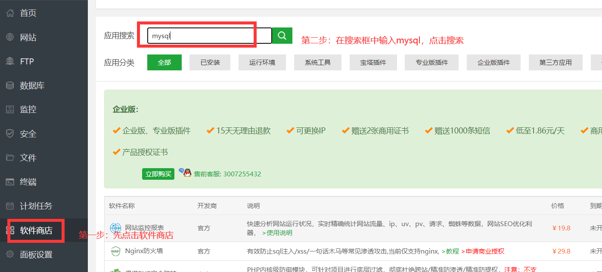 

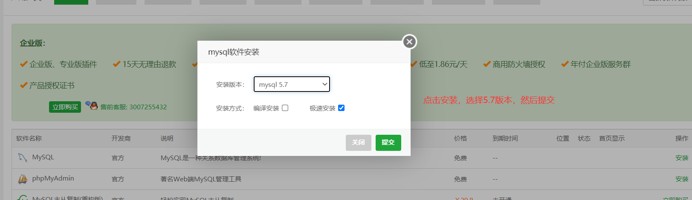

2、添加一个数据库

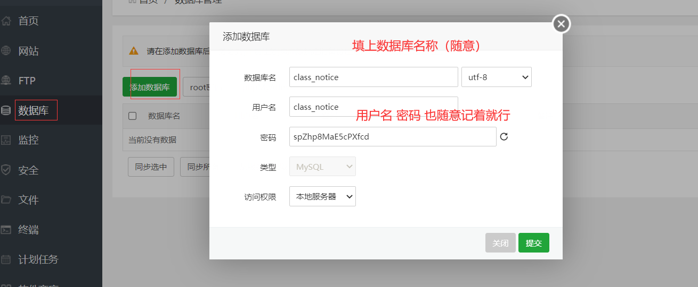

3、进入作者的git仓库[https://github.com/PBK-B/mirai-class-notice](https://github.com/PBK-B/mirai-class-notice)，点击Releases中最新的版本，然后点击class-notice\_linux.tar.gz开始下载

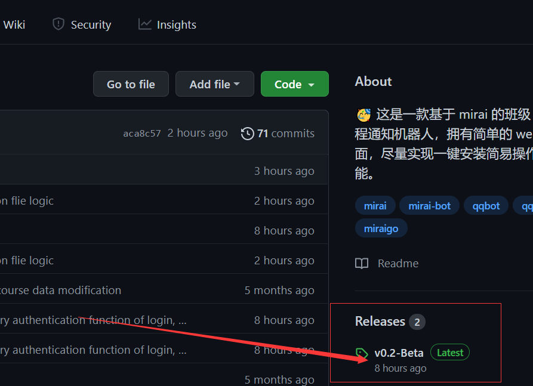 

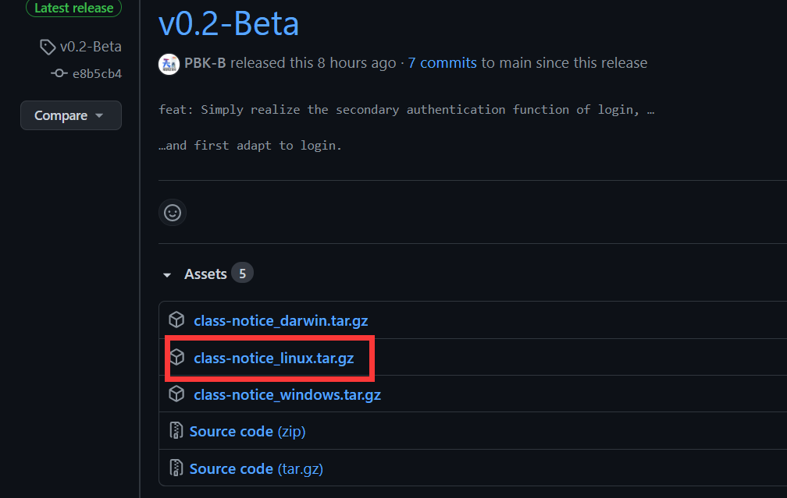

4、进入面板上的文件管理创建一个文件夹用于存放刚刚下载的文件，然后进入刚刚创建的文件夹，对文件上传、解压

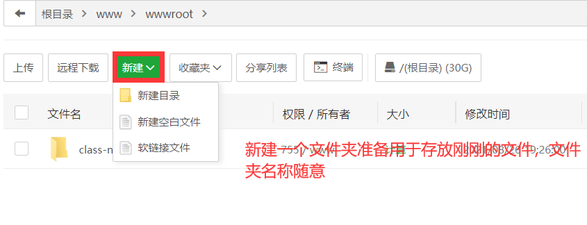 

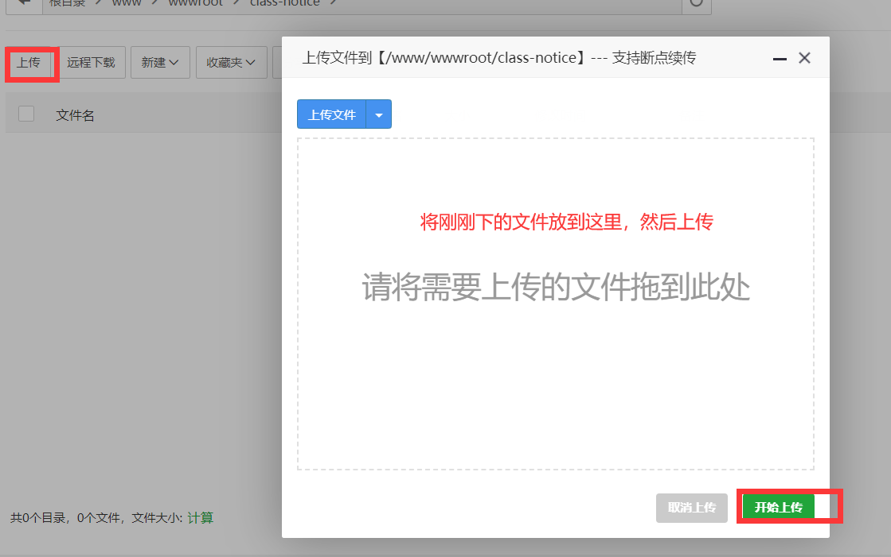 

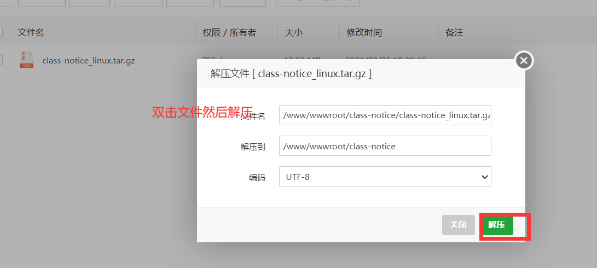

5、创建配置文件

（1）解压后进入conf文件夹，新建一个名为 app.conf 的空白文件

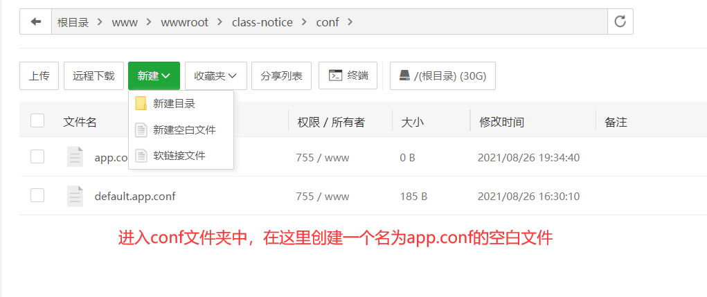

（2）数据刚刚创建的文件写入以下内容：

appname = class\_notice //不用管

httpaddr = 0.0.0.0 //不用管

httpport = 8989 //端口号，随意填写，建议大于5000

runmode = prod //不用管

dbhost = 127.0.0.1:3306 //不用管

dbdriver = mysql //不用管

dbusername = root //改成之前创建的数据库用户名

dbpassword = mysqlpassword //改成之前创建的密码

dbdatabase = test\_class\_notice //改成之前创建的数据库名

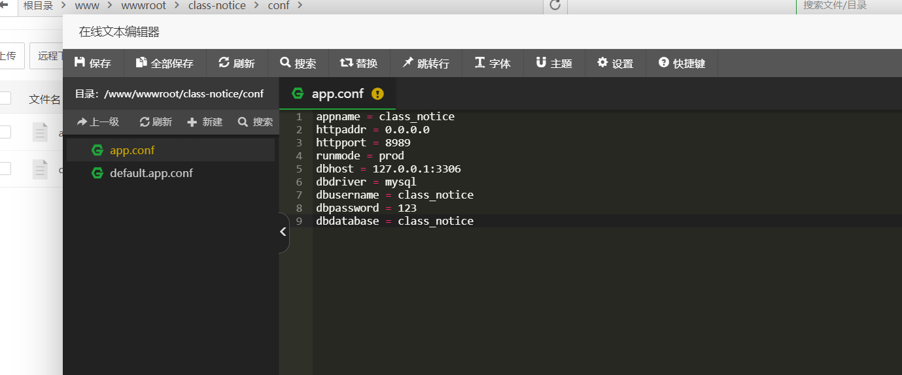

6、进入终端界面输入以下命令:

（1）安装screen软件方便后台运行

yum install screen -y

（2）进入之前创建的文件夹

cd /www/wwwroot/class-notice

（3）创建一个新窗口用于运行程序

screen -R class

（4）运行程序

./class\_notice

（5）当出现以下界面时程序运行成功，接着输入你的ip:8989就可以进去网站了（8989就是刚刚在配置文件里的httpport）

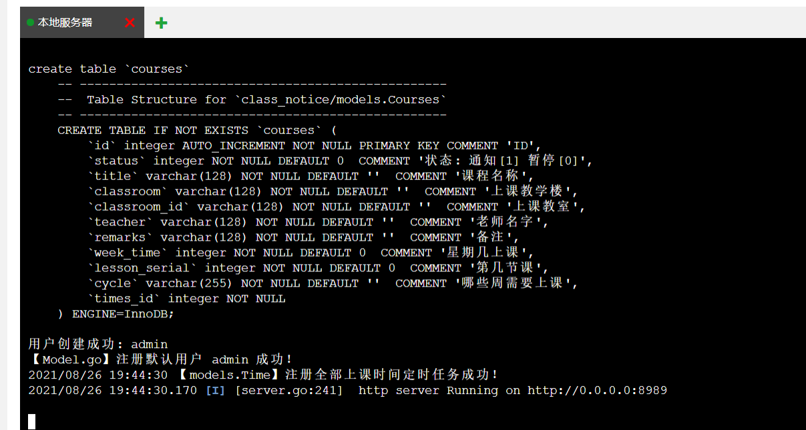 

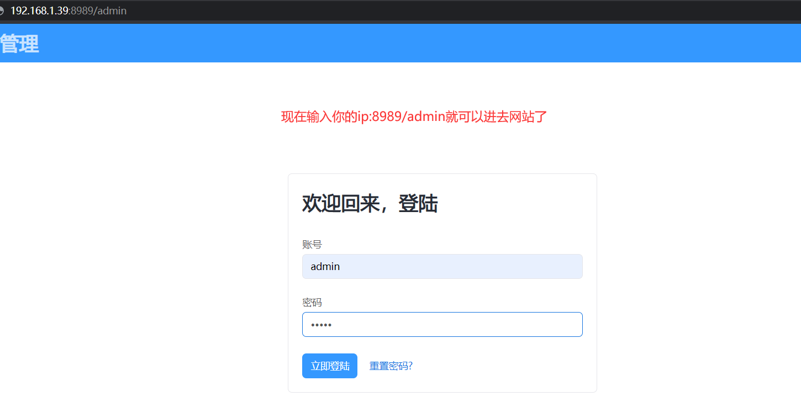

7、若无法访问，可能是没有放行你配置的端口（云服务器上也需要放行相应的TCP端口）

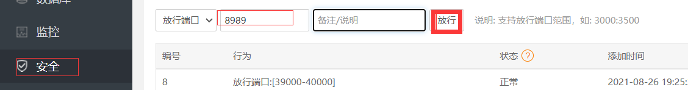

8、最后在终端界面按下 Ctrl + A + D 即可让程序后台运行，若要回到程序窗口，可输入以下命令： screen – r class
